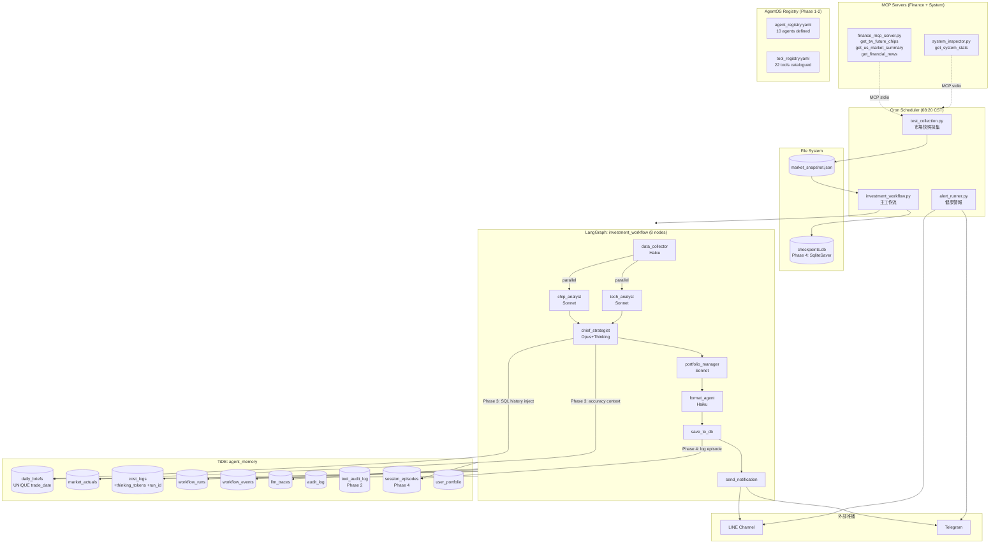

# AgentOS, MCP & Memory Architecture — Implementation Plan
**AI Agent Studio | 2026-05-15**

---

## Scope

Four-phase delivery based on 18 architecture analysis documents. Goal: add governance, context memory, and episodic learning without breaking existing workflow behavior.

---

## System Architecture (Post-Implementation)



---

## Phase 1: Agent Registry

**Status: Complete**
**Files: `agent_registry.yaml`**
**Code changes: None**

Defines all 10 agents with:
- `id`, `role`, `description`, `model`, `model_config`
- `tools.reads` / `tools.writes` — explicit I/O contract
- `memory_access.reads` / `memory_access.writes` — DB and file access
- `budget` — token limits and cost thresholds
- `permissions` — permission group membership
- `supervisor` / `reviewer` / `approval_required`
- `known_issues` — pre-existing tech debt flagged per agent

### Agent Summary

| Agent | Model | Graph | Position | Key Issue |
|-------|-------|-------|----------|-----------|
| data_collector | Haiku 4.5 | investment | 1 | — |
| chip_analyst | Sonnet 4.6 | investment | 2a ‖ | — |
| tech_analyst | Sonnet 4.6 | investment | 2b ‖ | — |
| chief_strategist | Opus 4.7 | investment | 3 | adaptive thinking (no cap) |
| portfolio_manager | Sonnet 4.6 | investment | 4 | silent yfinance fallback |
| format_agent | Haiku 4.5 | investment | 5 | — |
| save_to_db | — | investment | 6 | — |
| send_notification | — | investment | 7 | no delivery retry |
| backtest_evaluator | Haiku 4.5 | backtest | 3 | accuracy_report not persisted |
| maintenance_agent | Haiku 4.5 | maintenance | 2 | asyncio.run() anti-pattern |

---

## Phase 2: Tool Governance

**Status: Complete**
**Files: `tool_registry.yaml`**
**Code changes: `database_tools.py` (+3 functions)**

### Tool Registry
22 tools catalogued across 3 categories:
- 6 MCP tools (2 orphaned, 4 active)
- 14 direct Python calls
- 8 LLM invocations

### Orphaned Tool Action Required

| Tool | Risk | Action |
|------|------|--------|
| `save_brief_to_db` | HIGH | Add `MCP_WRITE_TOKEN` env guard (5 min) |
| `send_brief_to_user` | **CRITICAL** | Remove handler entirely (2 min) |

### New DB Functions

**`ensure_tool_audit_log_table()`** — Creates `tool_audit_log` table:
```
id | tool_id | tool_type | caller | run_id | status | latency_ms | error_message | detail | created_at
```
Called automatically by `ensure_observability_tables()`.

**`log_tool_call(tool_id, tool_type, caller, run_id, status, ...)`** — Inserts one audit row. Fails silently.

**`validate_tool_permission(tool_id, caller)`** — Checks `_TOOL_PERMISSION_RULES` dict. Returns False and logs on violation; **fail-open** (never blocks production).

High-risk tools with rules defined: `save_brief`, `add/delete/update_portfolio_item`, `send_line`, `send_telegram`.

---

## Phase 3: Context Engineering

**Status: Complete**
**Files: `context_engineering_change_report.md`**
**Code changes: `market_analyst_agents.py` (+2 constants, +inject block, +portfolio limit)**

### SQL History Injection (chief_strategist)

Chief strategist was completely amnesiac — zero historical context. After Phase 3:

```
user_content = chip_report + tech_report + recent_accuracy_history (≤800 chars)
```

The injected block is sourced by `get_recent_accuracy_context(days=14)` (new function in `database_tools.py`). Example output:
```
【近期預測準確率 70% (7/10筆)】
  2026-05-14 ✓ 預測 up(+0.8%) → 實際 +1.1%
  2026-05-13 ✗ 預測 up(+0.5%) → 實際 -0.3%
  ...
```

Returns `""` when no `market_actuals` join rows exist (first days of operation) → no change to behavior.

### Context Size Limits

```python
_CTX_LIMIT_CHIEF_HISTORY_CHARS = 800   # max injected history
_CTX_LIMIT_PORTFOLIO_CHARS     = 3000  # max portfolio PnL block
```

Portfolio block truncated at 3000 chars — protects against context explosion at 20+ holdings (scalability risk from memory_scalability_report.md).

### Snapshot Freshness
Already implemented in Phase 6 (observability): abort >12h, warn >6h, A-005 alert.

### Deferred: Reduce final_brief redundant passing
`final_brief` is consumed by both `portfolio_manager` and `format_agent`. Removing it from state would require restructuring the graph topology (>1h, breaking change). Deferred to Phase 5.

---

## Phase 4: Memory Phase 0

**Status: Complete**
**Files: `memory_phase0_change_report.md`**
**Code changes: `database_tools.py` (+2 tables +2 functions), `market_analyst_agents.py` (+price_stale), `investment_workflow.py` (+checkpointer)**

### 0-A: Singleton Engine ✅ Already done (P0 fixes: `@lru_cache` on `_engine()`)

### 0-B: Snapshot Freshness ✅ Already done (observability Phase 6)

### 0-C: Price Stale Flag (NEW)
In `portfolio_manager_node`: after `calculate_pnl()`, check if any holding's `current_price` equals `entry_price` (yfinance fallback). If so, emit `fallback_activated` event with `reason: price_stale`. Advisor still runs but the event is queryable.

### 0-D: UNIQUE trade_date ✅ Already done (observability migration)

### 0-E: LangGraph Checkpointer (NEW)
`SqliteSaver` added to `build_graph()`. Checkpoints to `./checkpoints.db` per `thread_id = run_id`. If workflow crashes after `chief_strategist_node`, re-invoking with the same `run_id` resumes from the saved checkpoint — Opus cost is not wasted.

### session_episodes Table (Phase 4 prep for Phase 5 vector memory)

New table created by `ensure_session_episodes_table()`:

```
id | run_id | trade_date (UNIQUE) | brief_id
predicted_direction | predicted_gap_pct
actual_direction | actual_gap_pct | direction_correct (backfilled by backtest_agent)
foreign_oi_net | trust_oi_net | dealer_oi_net
djia_chg_pct | ndx_chg_pct | sox_chg_pct | tsm_adr_chg_pct
divergence_signal | regime_sox | regime_foreign_oi
workflow_cost_usd | created_at
```

`log_session_episode()` called from `save_to_db_node` after `save_brief()`. Regime tags derived at insert time:
- `regime_sox`: strong / neutral / weak (threshold ±1%)
- `regime_foreign_oi`: bearish / neutral / bullish (threshold ±10k)

`actual_*` fields remain NULL until `backtest_agent` backfills them (Phase 5 item).

---

## Phase 5 (Future — Not Implemented)

| Item | Effort | Value |
|------|--------|-------|
| Vector embeddings for session_episodes (Chroma/TiDB Vector) | 12h | +10–15% accuracy |
| Backtest agent backfills session_episodes.actual_* | 2h | enables A-009 trend query |
| Remove send_brief_to_user handler (orphan) | 15 min | critical security fix |
| Enforce Opus thinking budget_tokens: 5000 | 15 min | cost cap |
| Re-enable TLS verify on TWSE fetcher | 15 min | security |
| Adaptive prompt versioning (A/B test) | 8h | +3–7% accuracy |
| asyncio.run() fix in maintenance_agent | 30 min | stability |

---

## Files Changed

| File | Change Type | Phase |
|------|-------------|-------|
| `agent_registry.yaml` | New | P1 |
| `tool_registry.yaml` | New | P2 |
| `database_tools.py` | +5 functions, +2 tables | P2, P3, P4 |
| `market_analyst_agents.py` | +context injection, +price_stale | P3, P4 |
| `investment_workflow.py` | +checkpointer | P4 |
| `agentos_implementation_plan.md` | New | — |
| `context_engineering_change_report.md` | New | P3 |
| `memory_phase0_change_report.md` | New | P4 |
