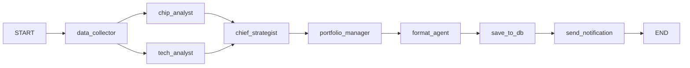
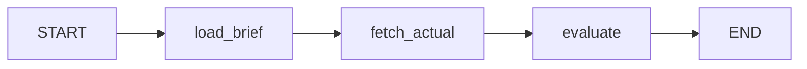
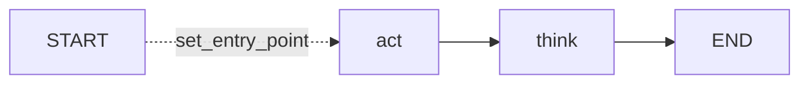

# LangGraph Analysis
**AI Agent Studio — Taiwan Stock Futures Analysis Team**
_Scan date: 2026-05-15 | Analyst: Principal AI Systems Architect_

---

## 1. Graph Inventory

| Graph | File | Nodes | Entry | Terminal |
|-------|------|-------|-------|---------|
| Investment Workflow | `investment_workflow.py` | 8 | `data_collector` | `send_notification` |
| Backtest Agent | `backtest_agent.py` | 3 | `load_brief` | `evaluate` |
| Maintenance Agent | `agent_orchestrator.py` | 2 | `act` | `think` |

---

## 2. Investment Workflow Graph

### State Schema

```python
class WorkflowState(TypedDict):
    snapshot:         dict          # raw market snapshot from market_snapshot.json
    raw_market_data:  dict          # compact JSON from data_collector (Haiku output)
    chip_report:      str           # JSON string from chip_analyst
    tech_report:      str           # JSON string from tech_analyst
    final_brief:      str           # prose report from chief_strategist
    portfolio_advice: str           # per-holding advice from portfolio_manager
    final_report:     str           # LINE-formatted text from format_agent
    db_row_id:        Optional[int] # TiDB row id from save_to_db
```

### Node Topology



### Node Details

| Node | Model | max_tokens | Input State Keys | Output State Keys |
|------|-------|-----------|-----------------|-----------------|
| `data_collector` | Haiku 4.5 | 1 024 | `snapshot` | `raw_market_data` |
| `chip_analyst` | Sonnet 4.6 | 1 024 | `raw_market_data` → fallback `snapshot` | `chip_report` |
| `tech_analyst` | Sonnet 4.6 | 1 024 | `raw_market_data` → fallback `snapshot` | `tech_report` |
| `chief_strategist` | Opus 4.7 + Thinking | 16 000 | `chip_report`, `tech_report` | `final_brief` |
| `portfolio_manager` | Sonnet 4.6 | 1 024 | `final_brief` + live portfolio P&L | `portfolio_advice` |
| `format_agent` | Haiku 4.5 | 2 048 | `final_brief`, `portfolio_advice` | `final_report` |
| `save_to_db` | — (no LLM) | — | `final_brief`, `tech_report`, `snapshot` | `db_row_id` |
| `send_notification` | — (no LLM) | — | `final_report` | `{}` |

### Edge Analysis

```
START → data_collector               (sequential)
data_collector → chip_analyst        (fan-out — declared parallel)
data_collector → tech_analyst        (fan-out — declared parallel)
chip_analyst → chief_strategist      (fan-in)
tech_analyst → chief_strategist      (fan-in)
chief_strategist → portfolio_manager (sequential)
portfolio_manager → format_agent     (sequential)
format_agent → save_to_db            (sequential)
save_to_db → send_notification       (sequential)
send_notification → END              (terminal)
```

> ⚠️ **Parallelism Warning**: The fan-out from `data_collector` to `chip_analyst` and `tech_analyst` is declared via two `add_edge` calls, which LangGraph interprets as a parallel fan-out. However, **all node functions are synchronous** (`def`, not `async def`). LangGraph uses a thread pool for sync nodes in parallel branches. In practice, the two branches likely execute with GIL contention, and Claude API calls (I/O bound) should still benefit. No explicit verification of parallel execution exists in the codebase.

---

## 3. Backtest Agent Graph

### State Schema

```python
class BacktestState(TypedDict):
    trade_date:      str            # YYYY-MM-DD
    brief_record:    Optional[dict] # row from daily_briefs table
    actual_data:     Optional[dict] # TWSE TAIEX actuals dict
    accuracy_report: str            # prose evaluation from Claude Haiku
```

### Node Topology



### Node Details

| Node | Model | Input | Output |
|------|-------|-------|--------|
| `load_brief` | — (no LLM) | `trade_date` | `brief_record` |
| `fetch_actual` | — (no LLM) | `trade_date` | `actual_data` (written to TiDB `market_actuals`) |
| `evaluate` | Haiku 4.5 | `brief_record`, `actual_data` | `accuracy_report` |

---

## 4. Maintenance Agent Graph

### State Schema

```python
class AgentState(TypedDict):
    system_stats:    dict  # psutil data from MCP
    final_analysis:  str   # Claude Haiku prose analysis
    status:          str   # READY | WARNING | CRITICAL | UNKNOWN
```

### Node Topology



> ℹ️ `agent_orchestrator.py` uses `set_entry_point("act")` (deprecated LangGraph API) instead of the current `add_edge(START, "act")`.

---

## 5. Missing LangGraph Features

### 5.1 Checkpointing

**Status: NOT IMPLEMENTED**

None of the three graphs configures a `checkpointer`. This means:
- If a node raises an exception, the entire graph run is lost — no resume from last checkpoint
- If `chief_strategist` (Opus, ~10–30 seconds) times out on step 7 of 8, all upstream computation is discarded
- No ability to replay or inspect intermediate states

**Required pattern:**
```python
from langgraph.checkpoint.memory import MemorySaver
graph.compile(checkpointer=MemorySaver())
```

### 5.2 Retry Logic

**Status: NOT IMPLEMENTED**

No node wraps its LLM call in retry logic. The only retry present is in `finance_mcp_server.py`'s `_retry()` helper (for HTTP calls), which is outside LangGraph.

Claude API transient errors (429 rate limit, 529 overloaded) will cause the entire workflow to abort. LangChain's built-in retry can be enabled with:
```python
llm.with_retry(stop_after_attempt=3)
```

### 5.3 Conditional Edges

**Status: NOT USED**

No graph uses `add_conditional_edges`. Error paths (e.g., `data_ok=False` from DataCollector) are handled inline within nodes rather than routing to an error-handling node.

### 5.4 Recursive / Cyclic Flow

**Status: NOT PRESENT**

All three graphs are strictly DAGs (directed acyclic graphs). No self-reflection loops, no human-in-the-loop interrupt nodes.

### 5.5 Streaming

**Status: NOT USED**

All `llm.invoke()` calls are blocking. No streaming response handling. Users wait for the full completion of each node before any output is visible.

### 5.6 State Persistence Across Runs

**Status: PARTIAL**

The `WorkflowState` dict is transient (in-memory only). Only `final_brief` is persisted to TiDB via `save_to_db_node`. `chip_report`, `tech_report`, `portfolio_advice`, and `final_report` are not stored and cannot be reconstructed after a run completes.
