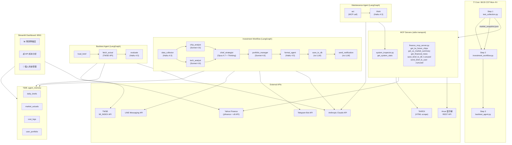

# Project Structure Analysis
**AI Agent Studio — Taiwan Stock Futures Analysis Team**
_Scan date: 2026-05-15 | Analyst: Principal AI Systems Architect_

---

## 1. Repository Overview

| Item | Value |
|------|-------|
| Project name | `ai-agent-studio` |
| Python requirement | `>=3.13` |
| Package manager | `uv` |
| Dev environment | Windows 11 (VS Code) |
| Production environment | Ubuntu server `10.0.1.20` (`ai-agents-server`) |
| Remote path | `/home/itadmin/ai_agent_studio/` |
| Cron trigger | `20 8 * * 1-5` (CST 08:20, weekdays) |
| VCS | Git (single branch `main`) |

---

## 2. Source Tree

```
ai-agent-studio/
│
├── pyproject.toml              # uv/PEP 621 project manifest
├── .env.template               # credential template (committed)
├── .gitignore                  # excludes .env, __pycache__, .venv, .claude/
├── daily_run.sh                # cron automation (⚠ LOCAL COPY STALE vs remote)
│
├── main.py                     # ⚠ PLACEHOLDER — prints "Hello from ai-agent-studio!"
│
│── ── MCP Servers ──────────────────────────────────────────────────────────────
├── mcp_servers/
│   ├── finance_mcp_server.py   # Finance data collector (5 tools, 1 resource)
│   └── system_inspector.py     # Ubuntu health probe (1 tool)
│
│── ── Core Agents & Workflow ───────────────────────────────────────────────────
├── investment_workflow.py      # Main orchestrator — 8-node LangGraph pipeline
├── market_analyst_agents.py    # All node implementations + WorkflowState
├── backtest_agent.py           # Self-reflection agent — 3-node pipeline
├── agent_orchestrator.py       # Maintenance agent — 2-node pipeline
│
│── ── Data & Persistence ───────────────────────────────────────────────────────
├── database_tools.py           # SQLAlchemy/PyMySQL TiDB helpers (4 tables)
├── portfolio_tools.py          # Portfolio P&L enrichment via yfinance
├── twse_fetcher.py             # TWSE public API client (TAIEX daily data)
├── messenger_tools.py          # LINE Messaging API + Telegram push
│
│── ── Data Collection ──────────────────────────────────────────────────────────
├── test_collection.py          # Concurrent MCP finance data snapshot collector
├── test_mcp_client.py          # System inspector MCP smoke test
│
│── ── Dashboard ────────────────────────────────────────────────────────────────
├── dashboard.py                # Streamlit multi-tab dashboard (3 tabs)
│
│── ── Runtime Artifacts (gitignored) ──────────────────────────────────────────
├── market_snapshot.json        # Latest finance data snapshot (overwritten each run)
├── collection_journal.jsonl    # Append-only collection audit log (no rotation)
│
└── docs/
    ├── deployment_guide.md
    └── [analysis reports]
```

---

## 3. Mermaid Architecture Diagram



---

## 4. Module Relationships

```
investment_workflow.py
    └─ imports: market_analyst_agents (nodes + WorkflowState + _MODEL_HAIKU + _PRICING ⚠)
    └─ imports: database_tools (cost/portfolio table setup)
    └─ imports: langgraph

market_analyst_agents.py
    └─ imports: database_tools (log_cost)
    └─ imports: portfolio_tools (get_user_portfolio, calculate_pnl)
    └─ imports: messenger_tools (send_brief)
    └─ imports: langchain_anthropic, langgraph

backtest_agent.py
    └─ imports: database_tools (get_brief, save_actual, get_recent_accuracy)
    └─ imports: twse_fetcher (get_taiex_actuals)
    └─ imports: langchain_anthropic, langgraph

agent_orchestrator.py
    └─ imports: mcp.client (stdio_client)
    └─ imports: mcp_servers/system_inspector (via subprocess)
    └─ imports: langchain_anthropic, langgraph

test_collection.py
    └─ imports: mcp.client (stdio_client)
    └─ imports: mcp_servers/finance_mcp_server (via subprocess)

finance_mcp_server.py
    └─ sys.path.insert ← project root (⚠ fragile)
    └─ imports: database_tools (save_brief)
    └─ imports: messenger_tools (send_brief)
    └─ imports: httpx, yfinance, beautifulsoup4

portfolio_tools.py
    └─ imports: database_tools (get_portfolio)
    └─ imports: yfinance

dashboard.py
    └─ imports: database_tools (all query/write functions)
    └─ imports: portfolio_tools (calculate_pnl, via lazy cache)
    └─ imports: yfinance (via get_stock_history)

twse_fetcher.py
    └─ imports: httpx (verify=False ⚠)

messenger_tools.py
    └─ imports: httpx

database_tools.py
    └─ imports: sqlalchemy, pymysql
```

---

## 5. Dependency Summary

| Package | Version Pin | Purpose | Risk |
|---------|-------------|---------|------|
| `langchain-anthropic` | `>=1.4.3` | Claude API client | Loose pin — breaking changes possible |
| `langgraph` | `>=1.2.0` | Workflow orchestration | Loose pin |
| `mcp` | `>=1.27.1` | MCP stdio transport | Loose pin |
| `sqlalchemy` | `>=2.0` | ORM / DB engine | Stable |
| `pymysql` | `>=1.1.1` | MySQL/TiDB driver | Stable |
| `yfinance` | `>=1.3.0` | US/TW stock data | **API changes frequently without notice** |
| `httpx` | `>=0.28.1` | HTTP client | Stable |
| `beautifulsoup4` | `>=4.14.3` | TAIFEX HTML scrape | Fragile if TAIFEX changes page structure |
| `lxml` | `>=6.1.0` | HTML parser backend | Stable |
| `streamlit` | `>=1.45` | Dashboard | Loose pin |
| `pydantic` | `>=2.13.4` | Data validation | Stable |
| `psutil` | `>=7.2.2` | System stats | Stable |
| `loguru` | `>=0.7.3` | Structured logging | Stable |
| `python-dotenv` | `>=1.2.2` | Env loading | Stable |
| `pandas` | `>=3.0.3` | Data frames | Stable |

**No `uv.lock` committed** — builds are NOT reproducible. Installing on a fresh machine may pull different minor versions.

---

## 6. Infrastructure Files

| File | Status | Notes |
|------|--------|-------|
| `docker-compose.yml` | **ABSENT** | `.env.template` mentions `docker/tidb-compose.yml` but file does not exist in repo |
| `Dockerfile` | **ABSENT** | No containerization for the agents themselves |
| `daily_run.sh` (local) | **STALE** | Contains old 3-step logic; remote version is the authoritative copy |
| `crontab` | Remote only | `20 8 * * 1-5` on `ai-agents-server`, not version-controlled |
| `pyproject.toml` | Present | No `[tool.uv]` lock section; no dev-dependency separation |
| `.env.template` | Present | Mentions `docker/tidb-compose.yml` which does not exist |
